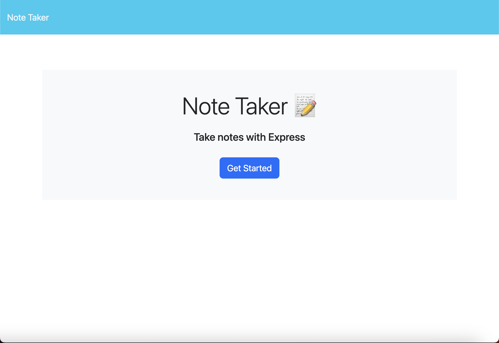
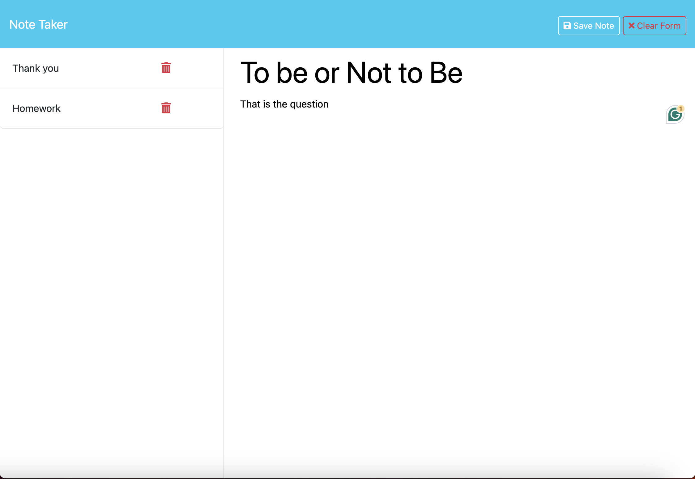

## NoteTaker
https://sheltered-caverns-60070-6d699cf8efcb.herokuapp.com/

## Description
NoteTaker is a simple web application that allows users to take and manage notes. Users can create new notes, view existing notes, update notes, and delete notes.

## Usage
To use the NoteTaker application, start by visiting the NoteTaker website. Once there, you can create a new note by clicking on the "New Note" button. This will open a form where you can enter a title and content for your note. After filling out the note details, click the "Save Note" button to save your note. To view a note, simply click on the note title in the list of notes. If you want to edit a note, click on the note title to open it, make your changes, and then click the "Save Note" button again. To delete a note, click on the delete icon next to the note title. This will remove the note from the list of notes.

### Home Page

### Notes Page

## Ideas for future improvement
- Add user authentication to allow multiple users to save their own notes.
- Implement real-time collaboration features to allow multiple users to edit notes simultaneously.

## Credits
Please see the following sites that were used:
### Starter Code
Start code provided by EdX Coding Bootcamp to complete assignment

### Information on UUID NPM
https://www.npmjs.com/package/uuid
